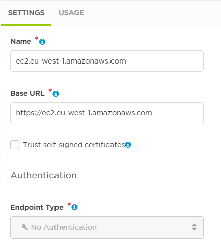

# AWS EBS Resize Workflow

This workflow provides a complete process to handle an AWS CloudWatch alarm delivered via SNS for an EBS volume that is running low on space. The workflow will attempt to increase the size of the volume by a defined scale factor. If unsuccessful at any step, a xMatters event is created.

<kbd>
  
</kbd>

## Prerequisites

* xMatters account - if you don't have one, [get one!](https://www.xmatters.com/)
* AWS account - if you don't have one, [get one!](https://portal.aws.amazon.com/billing/signup#/start)
* AWS CloudWatch agent installed on supported instances so that disc metrics are reported to CloudWatch.
* AWS Service Manager configured for supported instances.

## Files

* AWS-EBS-Resize-Workflow.zip

## How it works

When a CloudWatch alarm condition is met, an AWS Simple Notification Service (SNS) message is published and picked up by the SNS subscription. The subscription is tied to a Topic, which triggers a webhook in the workflow.

The workflow takes the relevant information from the alarm and determines the affected volume and attempts to resize it.

## Installation

* Import the workflow
* Following the instructions at <https://github.com/xmatters/xm-labs-AWScloudwatch> to configure the SNS/CloudWatch portion.

With the exception of the details below, the only item that may need altering is the scale factor to be used when a volume is resized. By default, the capacity will be doubled.

### Endpoints

Create endpoints for EC2 and SSM in each of the regions where you have instances you are monitoring.

The name must be of the format `service`.`region`.amazonaws.com where `service` is either `ec2` or `ssm` and `region` is a valid AWS region name.

The base URL must be `https://` followed by a copy of the name.

### Hashicorp Vault

A step has been included that attempts to authenticate with a Hashicorp Vault server and assume a specified AWS role.

If you do not use Vault, you will need to:

* Remove the step and the subsequent Switch step.
* Connect the `ALARM` switch state to `SNS-ExtractValues`
* Provide appropriate AWS credentials to any of the steps needing them.

If you do use Vault, you will need to:

* Configure a Vault endpoint with the URL of your Vault infrastructure
* Configure the `Vault-AssumeRole` step with a vault ID/secret AppRole ID and the AWS role to be assumed.

## Testing

* Create an EC2 instance and ensure that SSM is working with it.
* Create a CloudWatch alarm for a free disc space metric. It should be triggering the SNS topic created when the workflow was set up.
* Edit the alarm so that the state switches from OK to ALARM. This is done most simply by inverting the logic of the alarm.

Once the alarm activates, the workflow should be triggered and, a few moments later, the affected volume resized. If anything goes wrong, you should see a xMatters event created.

## Troubleshooting

The individual steps have been written so that if anything goes wrong, an even is created. If this happens, please review the activity log for the workflow to get a better insight as to why a step might have failed.

## Change History

25-Nov-20: Initial release
27-Nov-20: New step added to make sure that if the affected volume has previously been expanded but the filing system not resized, the workflow doesn't try and expanded the volume again. Fixed a bug in the resize script that was mistakenly changing the device name for non-NVMe devices.
